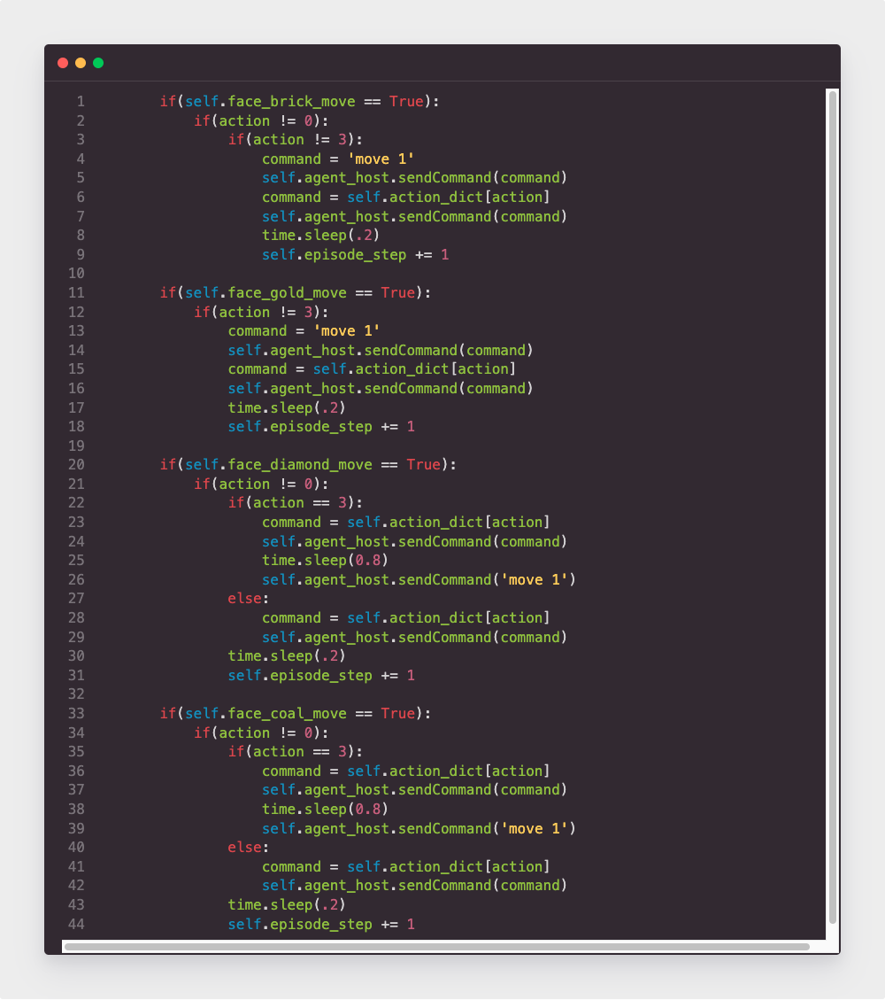

## **Video**

<iframe width="720" height="480" src="https://www.youtube.com/embed/gO7Sl99GDOo" frameborder="0" allow="accelerometer; autoplay; clipboard-write; encrypted-media; gyroscope; picture-in-picture" allowfullscreen></iframe>

<br />

## **Project Summary** 

The goal of our project is to train an agent through a dangerous zone surrounded by magma and there are many obstacles on the path that the agent needs to avoid to reach the end. While passing through obstacles, the agent needs to obtain diamonds from the diamond mine as much as possible to gain points, or it may lose points by digging coal by mistake. Compared with the map in the status report, the length of the map has been expanded from the original 100 blocks to 200 blocks, which effectively prevents the agent from reaching the destination line every time after training for a while. The agent will break the diamond mine or coal mine to move forward or bypass it. There are three different results, which are bonus points and minus points, and remain unchanged. The purpose of this is to use the rewards obtained from different behaviors to guide the agent to make the most correct choice. Obstacles on the map are randomly generated, and every gap is guaranteed to leave at least three blocks. Because the agent does not retreat, we will not set obstacles in front of the gap, or the agent will fall into an infinite loop.<br />

Finding a optimal route for this map is very complicated for AI. So, trivial algorithms like brute force or greedy will not be able to guarantee that the agent will complete within a limited number of steps. Therefore, reinforcement learning is the best solution. We still decided to use the PPO algorithm. Determines the future behavior of the agent by recording the observation results and the reward value. Our agent has made significant progress after learning 20,000 steps, and it has become smarter than the one in the status report. It learned to cross the gap and destroy the correct ore block and finally reached the destination line.<br />

#### **Aerial view**
{:height="50%" width="50%"}


#### **Overall view**
{:height="50%" width="50%"}


#### **First-person view**
{:height="50%" width="50%"}

<br />
## **Approaches**

#### **Map constraints**
```math
Width: 10 blocks
Length: 200 blocks
Maximum step per episode: 400 steps
Percentage of diamond mine: 15%
Percentage of coal mine: 15%
```

#### **Actions of agent**
```math
1. Moving forward for 1 block.
2. Moving left for 1 block.
3. Moving right for 1 block.
4. Break mine block
```

#### **Reward functions**
```math
1. Reward = 10 when agent collecting a diamond from breaking a diamond mine.
2. Reward = 10 when agent through a gap.
3. Reward = 100 when agent touchs destination line.
4. Reward = -1 for every steps agent move on stone.
5. Reward = -10 when agent collecting a coal from breaking a coal mine.
6. Reward = -10 when agent die from lava.
```

#### **Optimal Route**


#### **Sample Code**
TBD<br>

<br />

#### **Reinforcement learning algorithm**

In this project, we are using PPO to train our agent that make him perform better. The PPO algorithm is a new type of Policy Gradient algorithm. The Policy Gradient algorithm is very sensitive to the step size, but it is difficult to choose a suitable step size. If the difference between the old and the new strategy changes during the training process is too large, it is not conducive to learning. PPO proposes a new objective function that can be updated in multiple training steps in small batches, which solves the problem of difficult to determine the step length in the Policy Gradient algorithm. The main idea of the algorithm is to accept the state s, output the action probability distribution, sample the action in the action probability distribution, execute the action, get a reward, and jump to the next state. After we get the index of action, then we will make action_dict to be a parameter of sendCommand.<br>

We can collect a batch of samples after repeat these steps, and then use the gradient descent algorithm to learn these samples. A big improvement of PPO is to convert the On-policy training process in Policy Gradient into Off-policy. There are two probability density functions are written as p(x) and q(x). And p(x)/q(x) is called the ratio of the probability of taking the current action to the current state of the new and old strategy. In other words, the action is discrete, the output is a set of discrete probability distributions, the action is selected based on this probability distribution. We can fully sample the old policy, and then improve the new policy. This process can be repeated N times in a round instead of 1 time.<br>

**The gradient of the average reward value for N rounds:**<br>  
{:height="70%" width="70%"}

**In the actual training process, there will be an operation on the clip:**<br>
{:height="70%" width="70%"}

#### Basic approach

<br />

## **Evaluation**

#### ***Qualitative***
For the goal of the entire project, we need to pass through each gap made up of gold nuggets, and bypass or smash obstacles to reach the end. In the whole process, try to get the highest score possible. In the first half an hour, it was very difficult for the agent to pass through wall and obstacles, since he would always fall into the lava and die. However, after half hour, he began to pass through the gap skillfully and greatly reduced the number of times he fell into the lava, and began to work towards the finish line. When he could reach the finish line, he began trie to learn how to pass the obstacles, bypass or smash. During this time, he began to think about how to get a higher score on the premise of reaching the end. Because not only each step will pay a certain price, but the rewards obtained by breaking different blocks and picking up different items are different.<br>

#### ***Quantitative***
Once again clarify the agent's goal, the agent needs to get the highest possible score in the process of reaching the end. In this progress, the most important thing is reach the end line and finish the mission, so the reward he gain when he reach the finish line is the most highest. There are wall and lava in the map, and he will gain a negative reward if he touch the wall, and gain a more negative reward if he died when he touch lava. Therefore, he needs to reach the end in as few steps as possible, and try to avoid falling into the lava and death. And after he can reach the end line he should pay more attention on two obstacles: coal_ore and diamond_ore, and he would get coal and diamond if he smash them. The reward of these two itmes are different, so he should learn which he should smash to get a higher score.<br>

At the first 10 minutes, the agent has been trained for about 1000 steps. We can see that the agent learns very fast at the beginning, so the score rises quickly. Because of overfitting, the score showed a downward trend, but he soon adjusted his strategy and the score rebounded.<br>


After training about 4000 steps, the agent may meet a bottleneck, since the score seems to be stuck at 500, and it stays at 500 for 10 minutes. It may be that the agent has reached the end once and is trying to improve the score by another way.<br>


After one hour, the number of steps came to 12000 and the score stay at 800, and slightly decreased during this period. This may be because 800 is already the highest score that the agent can obtain through a long-term learning, so when trying other methods, the score was decreasing.<br>


After two hours, we can see from the figure that the agent has always maintained a high score which is 800, so we can guess and infer that the current agent has mastered the best skills and maintained his highest score range.<br>


## **References**

#### The following resourses were useful for our project.

1. [XML Schema Documentation](https://microsoft.github.io/malmo/0.21.0/Schemas/MissionHandlers.html)
2. [Pytorch Reinforcement Learning](https://github.com/bentrevett/pytorch-rl)
3. [Markdown Cheatsheet](https://github.com/adam-p/markdown-here/wiki/Markdown-Cheatsheet)
4. [Enjoy AI in Minecraft (Malmo and MineRL)](https://tsmatz.wordpress.com/2020/07/09/minerl-and-malmo-reinforcement-learning-in-minecraft/)
5. [Proximal Policy Optimization explanation](https://blog.csdn.net/qq_30615903/article/details/86308045)
6. [Interpretation of PPO reinforcement learning algorithm](https://zhuanlan.zhihu.com/p/31005035)
7. [How to record video on Mac](https://support.apple.com/en-us/HT208721)
