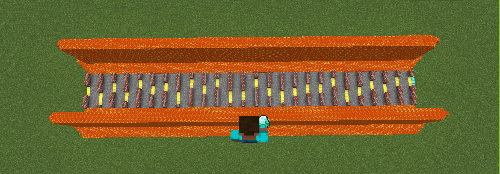
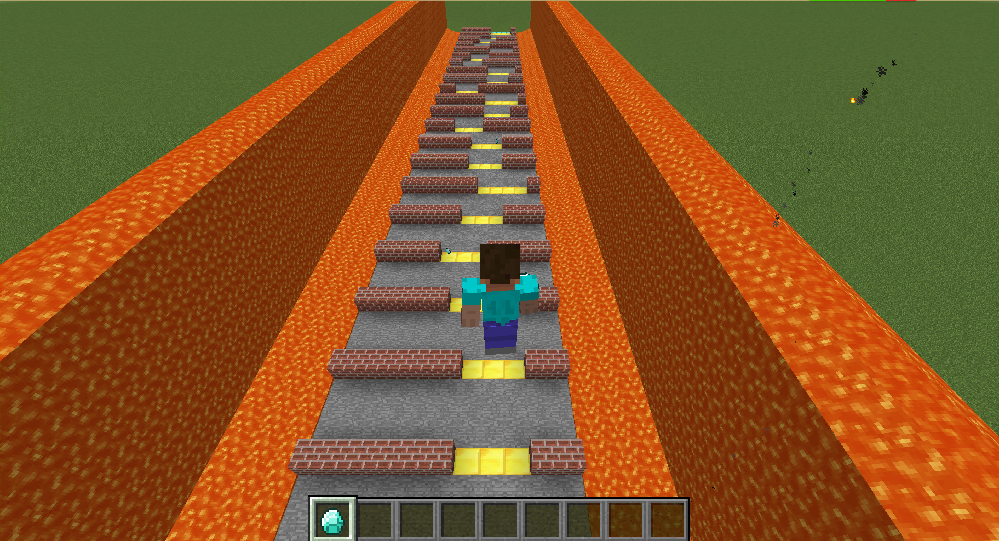

 
### CallMePro is a project in Minecraft inspired by the game Flappy Bird. The purpose of this project is to use reinforcement learning algorithm to make the agent reach the destination with as few steps as possible. While avoiding obstacles, the agent must get as many diamond rewards as possible too. 

{:height="50%" width="50%"}
{:height="50%" width="50%"}

 
Checkout our [Sourse Code](https://github.com/Markmzy/CallMePro) 
Sample [Video]()

Reports:
- [Proposal](proposal.html)
- [Status](status.html)
- [Final](final.html)

