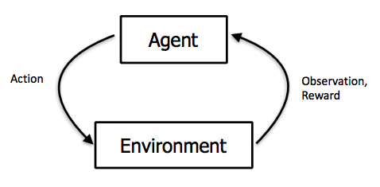
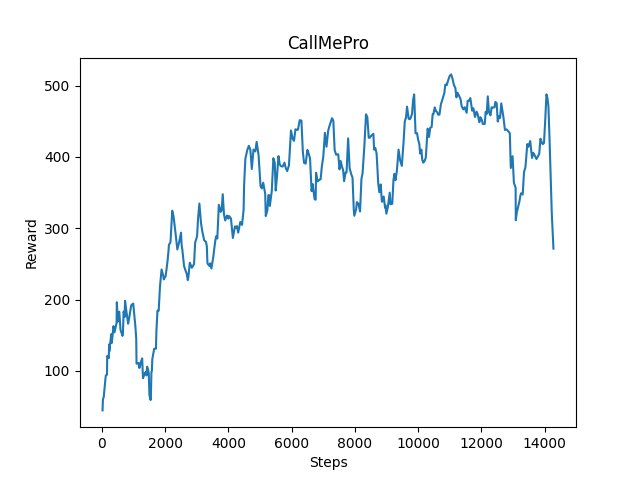

### Sample Video

<iframe width="720" height="480" src="https://www.youtube.com/embed/gO7Sl99GDOo" frameborder="0" allow="accelerometer; autoplay; clipboard-write; encrypted-media; gyroscope; picture-in-picture" allowfullscreen></iframe>
<br />

[Video](https://www.youtube.com/watch?v=gO7Sl99GDOo)
<br>

### Summary

At the very beginning, our initial idea was to make a mini-game similar to Flappy Bird in minecraft and train a AI to reach the destination. But we found that with our current knowledge, this is a very challenging thing. So we changed from avoiding vertical obstacles to avoiding horizontal obstacles. There is deadly lava on both sides of the road, which prevents players from getting around these obstacles from both sides. We also add some random diamonds with bonus points to the map. Actually, if you look down from the air, the map design is similar to flappy bird. Now the player will not die when hitting the wall, but the more steps used, the lower the reward will be. If a player not complete within a certain number of steps, it will be considered a failure too. The difficulty of the map can be changed in the future, such as increasing the complexity of obstacles, laying deadly lava on the floor, making the path longer, etc. We may continue to add interesting elements to make this project more complete.

{:height="70%" width="70%"}
{:height="70%" width="70%"}


### Approach

For this project, we are using PPO to train our agent to let him learn better. PPO is a new method of Policy Gradient, and got a big improvement. The main idea of the algorithm is to accept the state s, output the action probability distribution, sample the action in the action probability distribution, execute the action, get a reward, and jump to the next state.  
(action probability distribution: 0: 'move 0',  # Stop  
                                  1: 'strafe 1',  # Move one block left  
                                  2: 'strafe -1',  # Move one block right)  
After we get 0, 1 or 2 from action, then we will make action_dict to be a parameter of sendCommand to erform actions.  
Under such a step, we can collect a batch of samples, and then use the gradient descent algorithm to learn these samples. A core improvement of PPO is to convert the On-policy training process in Policy Gradient into Off-policy. There are two probability density functions are written as $p(x)$ and $q(x), and $p(x)/q(x)$ is called the ratio of the probability of taking the current action to the current state of the new and old strategy. On the other word, the action is discrete, the output is a set of discrete probability distributions, the action is selected based on this probability distribution. $p(x)/q(x) is this action corresponds to a probability value in the current state in the new and old strategies.  
And then we can fully sample the old policy, and then improve the new policy. This process can be repeated N times in a round instead of Is 1 time. The gradient of the average reward value for N rounds:  
图1:  
In the actual training process, there will be an operation on the clip:  
图2:  


{:height="70%" width="70%"}

**Actions of agent**

```math
1. Moving forward for 1 block.
2. Moving left for 1 block.
3. Moving right for 1 block.
```
**Reward Functions**

```math
1. Reward = 10 when agent collecting a diamond on the floor.
2. Reward = 10 when agent through a gap.
3. Reward = 100 when agent touchs destination line.
4. Reward = -1 for every steps agent move on stone.
5. Reward = -10 when agent die from lava.
```

### Evaluation

* Qualitative:<br>
For our project, the goal for the agent is to approach the destination with the least number of steps to avoid more deductions. Because the less deduction the agent gains, the higher rewards he gets. Before reinforcement learning, the agent’s movement looked a bit dumb, since he would get stuck in front of the obstacle and move left and right repeatedly. And in many cases, he would swim in lava. And even if he passes the obstacle, it is difficult for it to reach the destination within the maximum number of steps per episode. However, after learning for a half-hour, the agent approaches the destination successfully sometimes, but the rewards it got still not good as expected. Therefore, the agent should try to reduce the steps it uses to approach the destination, since the more steps he used, the more rewards he lost because every second before reaching the destination, the agent will be punished. After learning for 2 hours, the agent could reach the destination line every time, and gain more and more rewards. The agent becomes smart enough to pass all gaps, and be able to identify which side the gap is when encountering a wall.<br>


* Quantitative:<br>
From the following three pictures, we know that the purpose of this program is to allow agents to get more rewards. In these three return graphs, we can clearly see that after a lot of training, the agent is getting more and more rewards. In the agent's course of action, the agent can be rewarded by passing gold blocks and get diamonds, and every step the agent takes and falling into the lava will also cause corresponding punishment to the agent. The most important thing is that passing the destination line will give the agent a lot of rewards, so the agent is motivated to pass each gold block, get more diamonds, and use the fewest steps to reach the finish line. Through the three return graphs, we can see that the speed of the agent's advance is increasing, The agent is guarantee to pass this map every time. However, after 14000 steps, the progress of the agent is not so obvious. This might because the map is too simple for the agent now.<br>

### After training 6000 steps:
{:height="50%" width="50%"}
### After training 14000 steps:
{:height="50%" width="50%"}
### After training 20000 steps:
{:height="50%" width="50%"}


<br />

### Remaining Goals
Until this status report, we have not implement more maps with different difficulty. For example, the length of the path is a constant 100 now, and we may increase it in the future version. Furthermore, the only obstacle is the brisk block now, so we may add some other obstacles to increase the difficulty of the game. We may also add some penalties policy to improve the effectiveness of the reinforcement learning. We may also put more interesting element. For example, traps on the ground or arrows from both sides of the path. On the other hand, we also hope to implement some more useful algorithms to make the agent's actions more smooth and realistic.<br>

The ultimate goal of this project is to approach the score of human control as much as possible, or even exceed the score of human control. Therefore, we should have completed the optimization of all algorithms, and passed enough time and steps to train the agent, in order to make him reach the best condition. After that, we may invite some friends to play it and get the mean score. Then see whether the agent can approach it or exceed it.

### Challenges
The challenge we are facing right now is when the agent has collected some diamonds but then he died from swimming in lava, these diamonds would leave in where he died. However, after resetting the map, these diamonds were still in there. We need to fix this error to make these diamonds disappear when the map is reset. Because resetting map should clear all the items from the previous episode, and then generate a brand new episode.<br>  

Another problem we need to fix is the agent will not take the initiative to pick up diamonds on the gold block yet. Because each diamond worth 10 points, if the agent wants to gain as much as rewards, it should pick up more diamonds after learning. But right now, even after training for 3 hours, the agent still could not pick up diamonds initiatively to improve his reward points. This problem might be more difficult. So we might need to optimize our algorithm in the future.<br>  

The most difficult part is writing our own reinforcement learning algorithm. The current algorithm is still using the PPO library from assignment 2. We are learning Deep Q-learning and trying to use it in our project. Based on our knowledge, Deep Q-learning might be a better algorithm for our project. But it is hard for us to implement it in few weeks since we do not familiar with any reinforcement learning library.<br>


### Resources Used

#### The following resourses is useful when we doing our project.

1. [XML Schema Documentation](https://microsoft.github.io/malmo/0.21.0/Schemas/MissionHandlers.html)
2. [Pytorch Reinforcement Learning](https://github.com/bentrevett/pytorch-rl)
3. [Q-Learning in Python](https://www.geeksforgeeks.org/q-learning-in-python/)
4. [Math of Q-Learning — Python](https://towardsdatascience.com/math-of-q-learning-python-code-5dcbdc49b6f6)
5. [Markdown Cheatsheet](https://github.com/adam-p/markdown-here/wiki/Markdown-Cheatsheet)
6. [Enjoy AI in Minecraft (Malmo and MineRL)](https://tsmatz.wordpress.com/2020/07/09/minerl-and-malmo-reinforcement-learning-in-minecraft/)
7. [Deep Q-Learning Tutorial: minDQN](https://towardsdatascience.com/deep-q-learning-tutorial-mindqn-2a4c855abffc)

